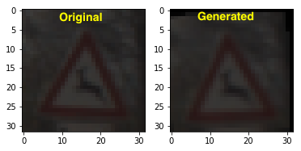

# **Traffic Sign Recognition**

## Writeup

---

**Build a Traffic Sign Recognition Project**

The goals / steps of this project are the following:
* Load the data set (see below for links to the project data set)
* Explore, summarize and visualize the data set
* Design, train and test a model architecture
* Use the model to make predictions on new images
* Analyse the softmax probabilities of the new images
* Summarize the results with a written report

### Data Set Summary & Exploration

#### Basic summary of the data set

- Number of training examples = 34799
- Number of validation examples = 4410
- Number of testing examples = 12630
- Image data shape = (32, 32, 3)
- Number of classes = 43

#### Exploratory visualization of the dataset.


The above image shows the distribution of data among the different classes of signs. You can see there are very few data sets for certain classes of traffic signs compared to others which will no doubt impact the accuracy of the learning of those classes later.


Here is a matrix of random images pulled out of each class. The first thing that can be noted is that the images appear to be taken under a large variety of lighting conditions. This does add to the complexity of the classification.

### Design and Test a Model Architecture

#### Data pre-processing

##### Generate extra data

Because there are significantly more samples of some classes than others in the training set, the model accuracy will have a bias toward the classes with more samples. Bad accuracy in a classes with a lot of samples leads to a large loss. In order to make sure the model recognise all classes of traffic sign equally well, more data is generated. This is achieved by taking a available image and randomly zoom, rotate and translate to result in an new image. An example can be seen below:



##### Grayscaling

The image is turned into greyscale because all information needed to recognise a traffic sign is encoded into the shape of the sign, colour varies a lot with different lighting condition. Getting rid of the colour component reduces the complexity of the module and reduces the irregularities in the data.

Here is the traffic sign images from the previous section after grayscaling.


##### Histogram Equalisation

This is an technique to even out the lighting condition of all the data further reducing data irregularities.

Here is the traffic sign images from the previous section after grayscaling.


It can be seen that images that are previous completely dark and hard to recognise and been brightened up and the whole dataset have the appearance of uniform lighting.

##### Normalisation

Make input data normally distributed with mean 0 and std 1. This allow weights and hyper-parameters to stay in predictable range and makes training and tuning to be faster.

#### Final model architecture

My final model consisted of the following layers:

| Layer                 |     Description                               |
|:---------------------:|:---------------------------------------------:|
| Input                 | 32x32x1 Greyscale image                       |
| Convolution           | 1x1 stride, same padding, outputs 32x32x64    |
| RELU                  |                                               |
| Max pooling           | 2x2 stride,  outputs 14x14x6                  |
| Convolution           |                                               |
| RELU                  |                                               |
| Max pooling           | 2x2 stride,  outputs 5x5x16                   |
| Fully connected       | Input = 400. Output = 120                     |
| RELU                  |                                               |
| Dropout               | 50% dropout probability                       |
| Fully connected       | Input = 120. Output = 84                      |
| RELU                  |                                               |
| Dropout               | 50% dropout probability                       |
| Fully connected       | Input = 84. Output = 10                       |

This is a LeNet architecture with two dropout layers for regularisation.

#### Model Choice and Tuning

A LeNet architecture is chosen because it is a proven model for learning image based data sets. The convolution layers can recognise features on various scales and is independent of the location of the feature inside the image.

starting from a BATCH_SIZE of 128 and a learning rate of 0.001, it is found that increasing number of epochs improved validation accuracy while changing learning rate in either direction made very little difference. BATCH_SIZE of 32 and a learning rate of 0.001.

The number of EPOCHS to run is constrained by the time and computing resources available. 20 EPOCHS was run and the final model was taken at the epoch where the validation accuracy was highest. This is an early termination regularisation where the model is taken at the highest accuracy point during the training process. In theory, if more time was available one could run more EPOCHS and could probably obtain a higher accuracy model.

It is observed during training that the testing data set accuracy is lower than the validation data accuracy. This suggest possible over-fitting. Hence the dropout layers are added as additional regularisation. If the drop rate of the layer is set too high, the model learns too slowly. A final rate of 0.55 (keep_prob 0.45) is chosen for balance of training speed and regularisation effectiveness. It is noticed that even with very high dropout rate, the test set accuracy is consistently lower than the other two sets. There is a possibility that the test set contains samples with unique features now present in the other two data sets.

My final model results were:
* training set accuracy of 0.977
* validation set accuracy of 0.975
* test set accuracy of 0.946

Here is the list of the classes with the worst precision and recall:
```
class_id precision recall sign_name
27       57.32%    78.33% Pedestrians
21       94.67%    78.89% Double curve
26       69.19%    81.11% Traffic signals
30       82.89%    84.00% Beware of ice/snow
18       94.81%    84.36% General caution
40       71.03%    84.44% Roundabout mandatory
22       92.24%    89.17% Bumpy road
 3       94.15%    89.33% Speed limit (60km/h)
20       82.83%    91.11% Dangerous curve to the right
42       95.35%    91.11% End of no passing by vehicles over 3.5 metric tons
```
Adding extra dummy data have greatly improved the prediction for classes with fewer data points.

### Test a Model on New Images

#### Five German traffic signs found on the web

Here are five German traffic signs that I found on the web:


All the images have been padded to square and resized to 32x32 pixels. The 2nd and 5th image might be difficult to recognise because they occupy very small portion of the whole image. The 4th image has a glare which might cause difficulty as well. Here are the results of the prediction:

|Image                                   |Prediction                              |
|:--------------------------------------:|:--------------------------------------:|
|Children crossing                       |Dangerous curve to the right            |
|No entry                                |No vehicles                             |
|Right-of-way at the next intersection   |Beware of ice/snow                      |
|Road work                               |Beware of ice/snow                      |
|Speed limit (30km/h)                    |Slippery road                           |

The accuracy is zero. We must have a problem. By examining the training data set and the images above it is found that the training images are framed such that the traffic sign is centred and covers most of the image. Hence we need to re-frame the images found online in order for them to recognised. By manually cropping the images, we have the following:


The model was then able to currently recognise 4 out of the 5 pictures giving an accuracy of 80%.

|Image                                   |Prediction                              |
|:--------------------------------------:|:--------------------------------------:|
|Children crossing                       |Bicycles crossing                       |
|Road work                               |Road work                               |
|Speed limit (30km/h)                    |Speed limit (30km/h)                    |
|No entry                                |No entry                                |
|Right-of-way at the next intersection   |Right-of-way at the next intersection   |


By calculating the softmax probabilities of the model output we can see the confidence of the predictions. Image 2,3,4 were predicted correctly with near 100% confidence. The top 5 softmax probabilities of the 2 less confident predictions can be seen below. Image 5 although was predicted correctly, it only had about 50% confidence.

|Image 1                                        |Image 5                                       |
|:---------------------------------------------:|:--------------------------------------------:|
|13.96% (Bicycles crossing)                     |56.59% (Right-of-way at the next intersection)|
|11.81% (Beware of ice/snow)                    |42.12% (Beware of ice/snow)                   |
|10.20% (Roundabout mandatory)                  | 0.43% (Double curve)                         |
| 8.24% (Right-of-way at the next intersection) | 0.33% (Slippery road)                        |
| 5.23% (Children crossing)                     | 0.23% (Bicycles crossing)                    |

Here are an visual representation of the predictions.


It can be seen that the model is confused by similar triangular shaped signs. Because the low resolution, the model was not able to hone in on the exact shape inside the triangle.


### Visualizing the Neural Network

The response of the convolution layers to an image is plotted below. The original image and the augmented image which feeds the network is plotted first. Followed by the response from the 6 features of the first layer convolution and 15 features of the second layer convolution.


Looking at the the visualisation, it can be seen that the first level of convolution was picking out the edges in the image. The second level seem to be more vague. It responds to larger patch features. It is clear that the weights responds to the shape of the sign.
